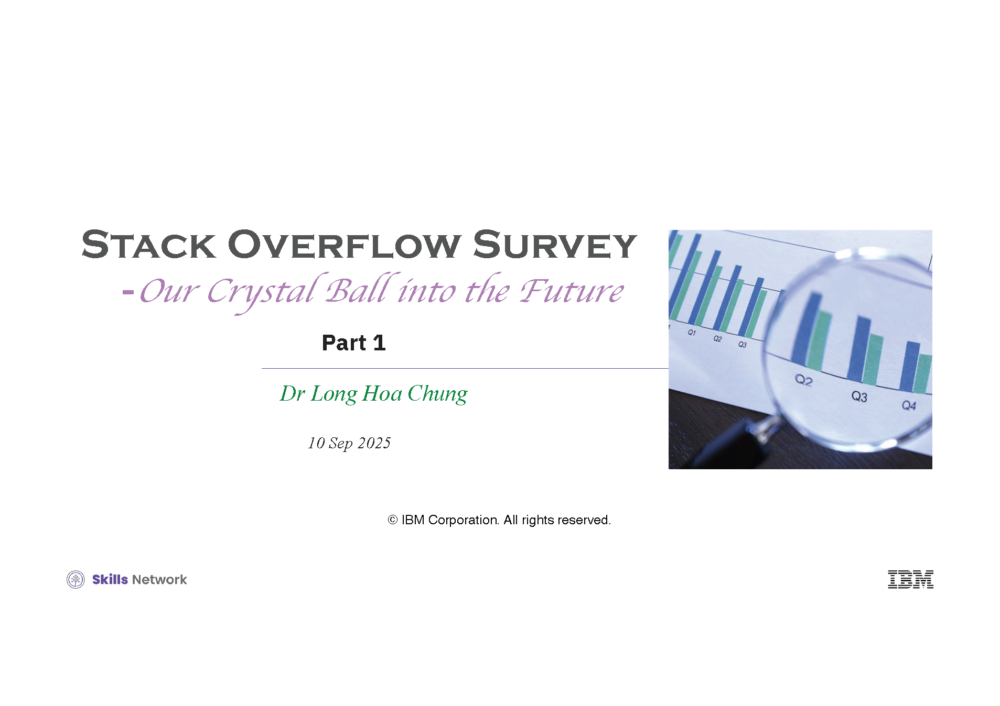
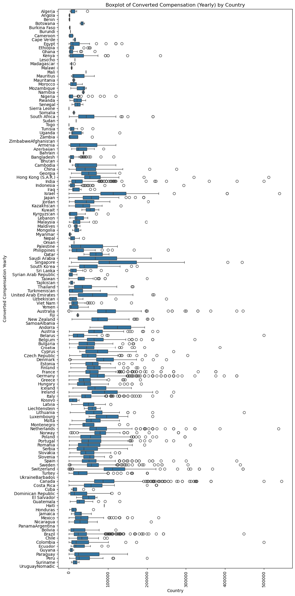
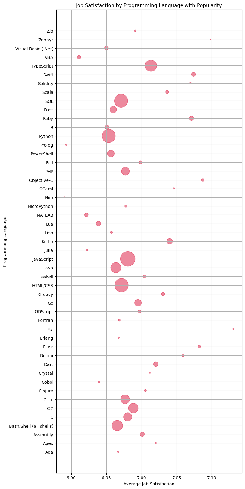
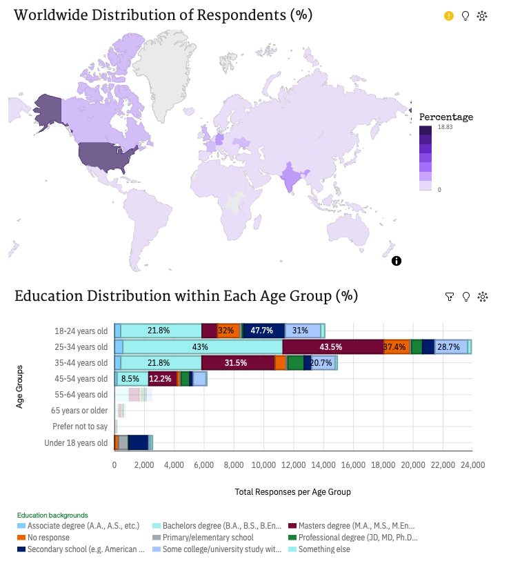
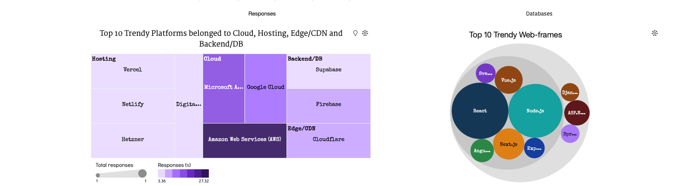
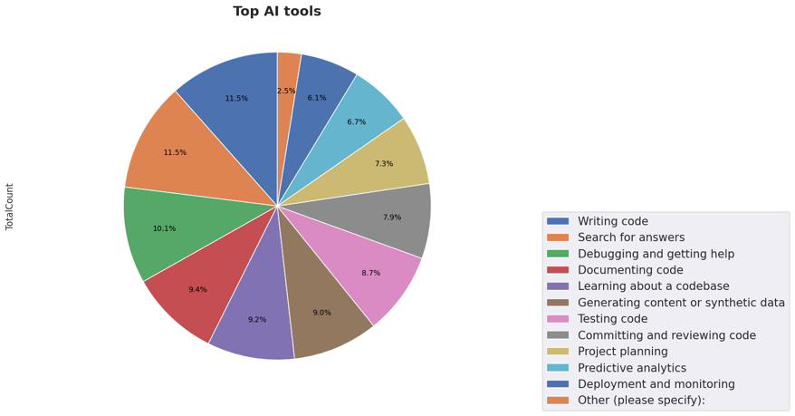
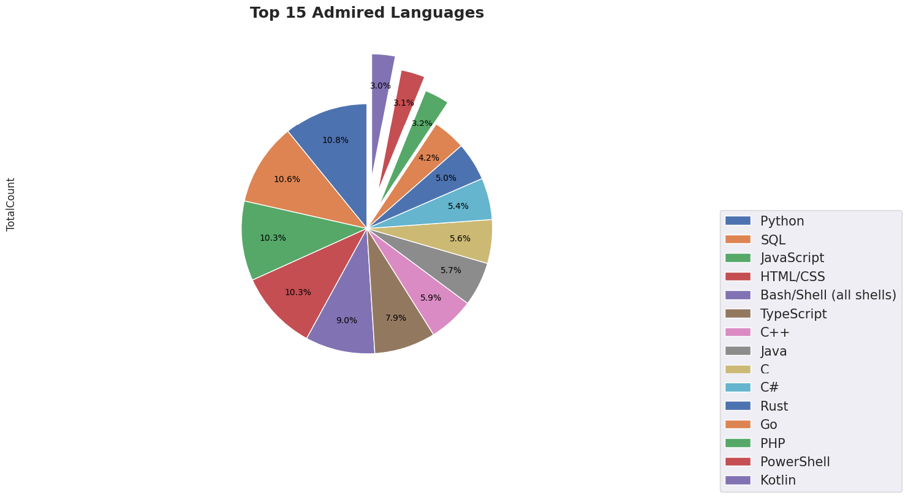

# Stack Overflow Survey Story Telling

# 📖 The Stack Overflow Storytelling Project

This project explores the [Stack Overflow Developer Survey](https://insights.stackoverflow.com/survey) to uncover insights into developer demographics, technology usage, and future trends.  
Using Python for data wrangling and visualisation, combined with IBM Cognos for interactive dashboards, the analysis highlights key patterns in programming languages, frameworks, databases, and emerging tools like AI.  

The goal is to transform raw survey data into meaningful visual stories — helping developers, educators, and businesses better understand the evolving tech landscape.


🗂️ **Repository Structure**  
Stack_Overflow_survey_story_telling/
│
├── README.md # Project overview (this file)
├── requirements.txt # Python dependencies
│
├── data/ # [Raw data is not stored locally, see below for online link]
│
├── notebooks/
│ ├── 01_data_wrangling.ipynb
│ ├── 02_visualisation.ipynb
│ ├── 03_storytelling.ipynb
│ ├── Bubble_visualisation.ipynb
│ ├── Finding_Outliers.ipynb
│ ├── Histogram_visualisation.ipynb
│ ├── Pie.ipynb
│ ├── Scatterplot_visualisation.ipynb
│ └── Supp_data_reprocessing.html
│
├── dashboards/
│ └── dashboard.ipynb
│
├── results/
│ ├── figures/
│ │ ├── banner/
│ │ │ └── Banner_clear.png
│ │ └── chart/
│ │ ├── boxplot_country.png
│ │ ├── Bubble_language_sat.png
│ │ ├── map_bar.png
│ │ ├── Tree_hierachical.png
│ │ ├── pie_AI_tools.png
│ │ └── pie_top15_admiredlanguage.png
│ └── summary_stats.csv
│
└── scripts/ # Helper Python scripts

---

## ⚙️ Tools & Technologies
- **Python:** pandas, matplotlib, seaborn, scikit-learn  
- **IBM Cognos Analytics:** interactive dashboards  
- **Jupyter Notebook:** step-by-step exploration and documentation  
- **GitHub:** version control and collaboration  

---

## 📊 Dashboard & Visualisations

**The interactive dashboard was created in IBM Cognos Analytics.**  
🔗 [View Dashboard (PDF export)](dashboards/Stack_overflow_survey.pdf)

**Dashboard notebook:**  
- [dashboard.ipynb](dashboards/dashboard.ipynb) (contains the dashboard visuals)

---

### 🚩 Banner



---

### 👀 Sneak Peek: Chart Highlights

#### Country-wise Distribution


#### Language Satisfaction (Bubble Chart)


#### Map Bar


#### Hierarchical Tree


#### AI Tools Usage (Pie Chart)


#### Top 15 Admired Languages (Pie Chart)


---

## 📁 Project Notebooks

- [01_data_wrangling.ipynb](notebooks/01_data_wrangling.ipynb)
- [02_visualisation.ipynb](notebooks/02_visualisation.ipynb)
- [03_storytelling.ipynb](notebooks/03_storytelling.ipynb)
- [Bubble_visualisation.ipynb](notebooks/Bubble_visualisation.ipynb)
- [Finding_Outliers.ipynb](notebooks/Finding_Outliers.ipynb)
- [Histogram_visualisation.ipynb](notebooks/Histogram_visualisation.ipynb)
- [Pie.ipynb](notebooks/Pie.ipynb)
- [Scatterplot_visualisation.ipynb](notebooks/Scatterplot_visualisation.ipynb)
- [Supp_data_reprocessing.html](notebooks/Supp_data_reprocessing.html)

---

## 🗃️ Data

- **Raw survey data is not stored locally.**  
- Access the official Stack Overflow Developer Survey data [here](https://insights.stackoverflow.com/survey).

---

## 🤝 Contributing

Pull requests are welcome! For major changes, please open an issue first to discuss what you would like to change.

---

## 📫 Contact

- [My GitHub](https://github.com/longchung90)  
- [LinkedIn](#) <!-- Add your LinkedIn URL here -->  
- [Email](mailto:your-email@example.com) <!-- Add your email here -->

---

---

## 🚀 Setup

To run this project locally:

1. Clone the repository:
   ```bash
   git clone https://github.com/longchung90/Stack_Overflow_survey_story_telling.git
   cd Stack_Overflow_survey_story_telling
2. Install dependencies:
pip install -r requirements.txt
3. Launch the Jupyter Notebook
jupyter notebook
Open the notebooks in `notebooks/` or `dashboards` folders to explore the analysis and visualisations

---


